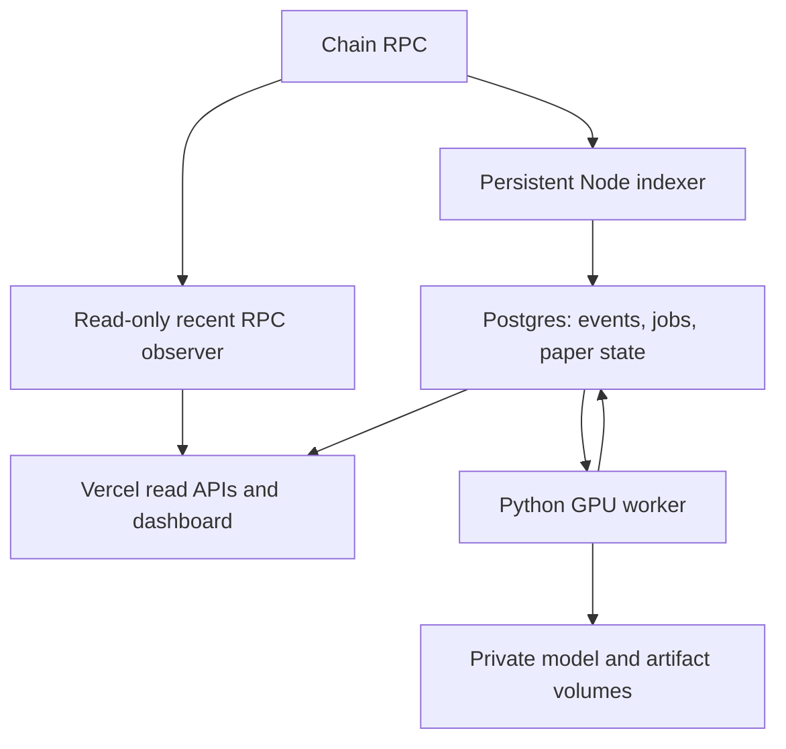

# Architecture and data contracts

## Runtime topology

The public application polls server snapshots every five seconds in direct RPC mode or every two seconds in indexed mode while its tab is visible and the view is not paused. `METATRAY_FEED=rpc` selects bounded recent observation without Postgres; `METATRAY_FEED=indexed` selects persistent history and model results. Missing configuration produces a structured setup snapshot with empty real-event data; synthetic replay requires `METATRAY_MODE=demo`. A WebSocket, when configured, wakes the indexer on new blocks; HTTP polling and log catch-up remain the source of recoverable event history. Browser polling never queries a private RPC directly.

## Repository map

| Path | Responsibility |
| --- | --- |
| `src/app/` | Next.js layout, routes, styles, error/not-found views |
| `src/components/dashboard.tsx` | Market/account UI, policy controls, receipts, science and deployment pages |
| `src/components/cortex.tsx` | Three.js schematic or actual fsaverage5 prediction rendering |
| `src/components/feed-console.tsx` | Connection age, chain window, decoded swap receipts, pipeline stages and repository evidence links |
| `src/components/cortical-atlas.tsx` | Completed-result history paired with summary statistics from each immutable job input |
| `src/lib/server/rpc-observer.ts` | Read-only confirmed recent window, factory discovery, canonical block checks, bounded requests and short cache |
| `src/lib/server/live-feed.ts` | Feed selection and sanitized setup/error snapshots |
| `src/lib/sources.ts` | MetaTray and immutable Meta code references; public explorer link validation |
| `src/components/chart.tsx` | Price chart and descriptive response trace |
| `src/lib/paper.ts` | Pure paper-account accounting and authored policy |
| `src/lib/demo.ts` | Deterministic synthetic replay, entirely separate from model output |
| `src/lib/stimulus.ts` | Factual input narration |
| `src/lib/types.ts` | Shared event, account, prediction and snapshot contracts |
| `src/lib/server/chain.ts` | Protocol ABIs, deployment discovery, swap decoding and price normalization |
| `src/lib/server/store.ts` | Atomic block application, queue creation and canonical rewind |
| `src/lib/server/db.ts` | Private database connections and transaction helpers |
| `src/lib/server/config.ts` | Live configuration and paper parameter validation |
| `src/lib/server/snapshot.ts` | Public projection of database state |
| `services/indexer.ts` | Long-running ingestion worker with a database advisory lock |
| `services/tribe/renderer.py` | Deterministic chart/tone/narration media construction |
| `services/tribe/adapter.py` | Actual upstream model loading, surface preparation and inference |
| `services/tribe/result.py` | Output shape, finiteness and segment-alignment checks |
| `services/tribe/worker.py` | Job leases, heartbeats, result publication and private artifacts |
| `services/tribe/prepare_models.py` | Explicit download of authorized immutable model snapshots |
| `services/tribe/smoke.py` | Operator render-only or real-GPU smoke test; no public publication |
| `db/001_initial.sql` | Initial Postgres migration |
| `scripts/` | Migration, doctor, browser check and deterministic source packaging |
| `tests/`, `services/tribe/tests/` | Accounting, event, PostgreSQL and scientific-contract tests |

## Protocol interpretation

Pons V2 discovery calls `getLaunchedToken(TOKEN_ADDRESS)` on the configured factory. It uses the returned curve, quote asset, pool fee and tick spacing, combined with the configured hook, to compute the future V4 pool ID. The indexer listens to both the curve and the pool manager throughout the session. It does not need a manual protocol switch at graduation.

Before running it against real funds or making protocol coverage claims, the operator must compare this ABI and pool-key construction with the actual deployed contract version. An EVM address by itself does not establish the chain or factory version. The package includes no assumed factory, hook, pool manager or token address.

| Source | Buy/sell interpretation | Price used |
| --- | --- | --- |
| CurveBuy / CurveSell | Explicit event type | Quote reserve divided by token reserve at the end of the block |
| Curve graduation with empty reserves | Explicit event type | Labeled effective execution ratio from that event's actual quote/token amounts |
| Uniswap V3 Swap | Negative token amount is a buy from the pool | Post-swap `sqrtPriceX96` normalized to quote per token |
| Uniswap V4 Swap | Positive caller token delta is a buy | Post-swap `sqrtPriceX96` normalized to quote per token |

V4 deltas are caller-relative; using the V3 sign convention would reverse classifications. Tests cover this difference. Raw integer amounts are retained as strings. BigInt is used for contract amounts, then display/accounting values become JavaScript numbers. Very small quantities and extreme magnitudes can lose numeric precision; this is a visual and paper simulation layer, not settlement accounting.

Curve prices are block-level observations, while pool prices are swap-level observations. Creator taxes, transfer fees and exact curve execution costs are not modeled as a matching engine. The fallback price basis appears in the event receipt rather than being concealed as an unchanged spot price.

The adapter follows one configured curve/pool market. It does not aggregate unrelated pools, every exchange, mempool intent, transfers or off-chain orders.

## Public event contract

Every `Tick` includes `id`, block timestamp, price, quote/token amounts, side, venue, block number/hash, transaction hash and log index. Its stable ID is `chainId:transactionHash:logIndex`. Demo events have a `demo:` ID and empty transaction/block hashes.

Removed, unmined, unrelated-pool, undecodable or zero-amount events are not converted into trades. The indexer verifies each fetched event's block hash against the block it is applying. Repeated canonical blocks are idempotent; mismatched parents and replacement hashes require a rewind.

## Atomic state and reorgs

A database advisory lock prevents two Node indexers from operating on the same database concurrently. A configuration fingerprint fixes the chain, token, start block, market, confirmation depth and paper parameters. Changing those requires a fresh database in this version.

Each block transaction inserts events, updates the paper account and stores a rollback checkpoint plus the new cursor. Historic backfill never generates retrospective paper fills. A block must contain new trades and be no more than 30 seconds old at processing time before it can produce a decision.

On a canonical mismatch the indexer searches retained checkpoints for an ancestor. Rewind locks affected jobs, removes their predictions, cancels their leases, deletes orphaned events/blocks and restores the ancestor's paper state. Locking jobs before deleting predictions closes the race with GPU publication. If no retained ancestor matches, the indexer degrades and requires an operator rebuild; it does not silently invent a history.

Only the configured trailing checkpoint horizon is retained, plus source blocks for currently queued/running jobs. This bounds the otherwise expensive copies of the paper ledger. Events and finished model jobs/results have separate retention needs described in deployment operations.

## Inference jobs and receipts

The indexer seals a rolling window only when its cursor is recent. It includes a pre-window seed price, all recorded events through the cutoff, a paper-account snapshot and the narration. More than 5,000 events inside a window is rejected rather than silently truncated. Newer jobs cancel queued work that has not started; a running job completes and is labeled by its actual input age.

A GPU worker claims with `FOR UPDATE SKIP LOCKED`, receives a UUID lease and renews it every 20 seconds. A lease older than 90 seconds can be reclaimed, up to three interrupted attempts. An ordinary inference exception fails the job and records a private diagnostic; it does not publish fallback output.

Before publishing, the worker locks the job again and verifies lease ownership, running status and source block hash. Cancelled or replaced work cannot publish. A private attempt directory contains:

| Artifact | Meaning |
| --- | --- |
| `input.json` | Exact structured market/paper input |
| `stimulus.mp4`, `stimulus.wav`, `speech.wav` | Actual generated sensory input |
| `preview.png` | Last rendered market frame |
| `events.csv` | Actual upstream event/transcript table; may include private host paths; its SHA-256 is retained in the private/public result manifest |
| `prediction.npz` | Full model array and original segment starts/durations |
| `manifest.json` | Result metadata, public summary and publication status |
| `render.log`, `error.txt` when applicable | Private operational diagnostics |

The public result contains the last surface frame, descriptive trace, upstream media-time offsets, model/checkpoint revisions and hashes, input cutoff and publication timestamp. Hashes attest correspondence between retained artifacts; they are not cryptographic proof that a trusted GPU executed the model. There is no signed attestation or on-chain anchoring in this version.

The Node input hash fingerprints the JSON serialized at queue time; the Python input-file hash fingerprints the retained formatted JSON file. They are deliberately named differently and should not be expected to match byte-for-byte. The stimulus hash is SHA-256 of the final video; output hash is SHA-256 of the retained NPZ.

## HTTP interface

| Route | Behavior |
| --- | --- |
| `GET /api/snapshot` | Demo or live market/account/model summary; live unavailable store returns 503 |
| `GET /api/snapshot?step=180&policy=observer` | Demo controls only; never changes a live account |
| `GET /api/predictions/{uuid}` | Actual stored result; 404 for absent/orphaned results or demo mode |
| `GET /api/mesh` | Stored fsaverage5 geometry in live mode; 404 until prepared |
| `GET /api/health` | Demo identification, or database/indexer liveness; not a GPU accuracy check |

There are no public mutation endpoints. Writes happen only in configured persistent workers. RPC credentials, HF tokens, permission records, user identities and private file paths are not included in public response schemas. Transaction hashes and configured token addresses are public market provenance, not participant identities.

## Known version-one boundaries

This is one token, one quote asset, one durable paper account and one model output stream per database. There is no wallet custody, authenticated user portfolio, token issuance, multi-chain aggregator, price oracle, audited execution engine, scientific ROI atlas overlay or trained financial policy. The code is structured so those could be separate additions with their own validation; they are not silently approximated here.
